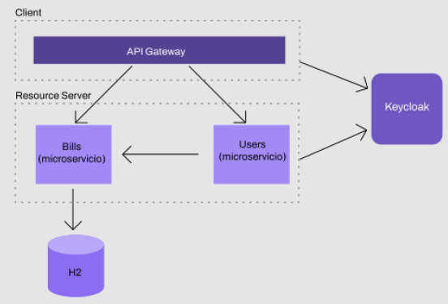

# Keycloak-Security-SpringBoot

*En KeyCloak:*

- Se crea un _CLIENT_ para luego configurar en el gateway con el tipo de acceso en confidencial.
- Se crean dos roles uno de ellos es el rol “user”.
- Se crean dos usuarios y se les asigna el rol “user”.
---

*En API gateway:*

- Se restringe el consumo de las APIs solo a usuarios autenticados.
- Si el usuario no está autenticado, deberá ser redirigido al login de Keycloak (se usa el _CLIENT_ creado en Keycloak).
- Se agregar el filtro TokenRelay para enviar el token al resto de los microservicios.
---

*En el microservicio Bills:*

- Se restringe el consumo de las APIs solo a usuarios autenticados.
- Se agrega un JWTConverter personalizado para obtener los roles y el scope del JWT para luego hacer restricciones.
- Se permite solo a usuarios con rol “user” consumir el endpoint bills/all.
---

*Diagrama del Sistema*

---

Ahora trabajamos en el sistema de faturación. Para esta etapa vamos a trabajar en dos funcionalidades nuevas:
- Los diferentes proveedores de facturas podrán crear facturas.
- Los usuarios podrán buscar sus facturas.

*Tomando en cuenta el diagrama se nos pide:

*En Keycloak:*
- Crear un grupo llamado PROVIDERS.
- Asignar usuarios a este nuevo grupo.
- Crear un cliente que permita autenticarse utilizando las credenciales del cliente
(client credentials).
---

*En bills-service:*
- Crear un endpoint que nos permita dar de alta facturas. Restricciones:
- Solo los usuarios pertenecientes al grupo PROVIDERS podrán dar de alta
facturas. Leer del JWT el listado de grupos para luego validar en el controller.
- Crear un endpoint que nos permita buscar facturas por ID de usuario. Restricciones:
- Usuarios autenticados.
---

*En users-service:*
- Crear el microservicio y agregar un endpoint que nos permita buscar a un usuario y
sus facturas.
- Buscar el usuario por ID utilizando Keycloak REST Admin Client.
- Para buscar las facturas, utilizar Feign. Configurar el cliente de Feign para
autenticarnos y obtener el token de Keycloak cuando enviamos la petición.
---

*En API Gateway:*
- Agregar al ruteo el microservicio de usuarios.
---

- TIP: Para obtener el access token y utilizarlo desde Postman podemos completar los
siguientes campos en Postman y hacer clic “Get New Access Token”.
