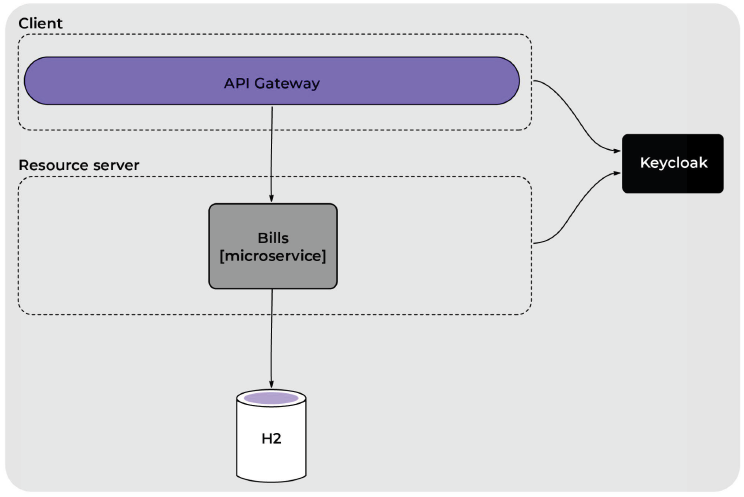

# Keycloak-Security-SpringBoot

*En KeyCloak:*

- Se crea un _CLIENT_ para luego configurar en el gateway con el tipo de acceso en confidencial.
- Se crean dos roles uno de ellos es el rol “user”.
- Se crean dos usuarios y se les asigna el rol “user”.
---

*En API gateway:*

- Se restringe el consumo de las APIs solo a usuarios autenticados.
- Si el usuario no está autenticado, deberá ser redirigido al login de Keycloak (se usa el _CLIENT_ creado en Keycloak).
- Se agregar el filtro TokenRelay para enviar el token al resto de los microservicios.
---

*En el microservicio Bills:*

- Se restringe el consumo de las APIs solo a usuarios autenticados.
- Se agrega un JWTConverter personalizado para obtener los roles y el scope del JWT para luego hacer restricciones.
- Se permite solo a usuarios con rol “user” consumir el endpoint bills/all.
---

*Diagrama del Sistema*

